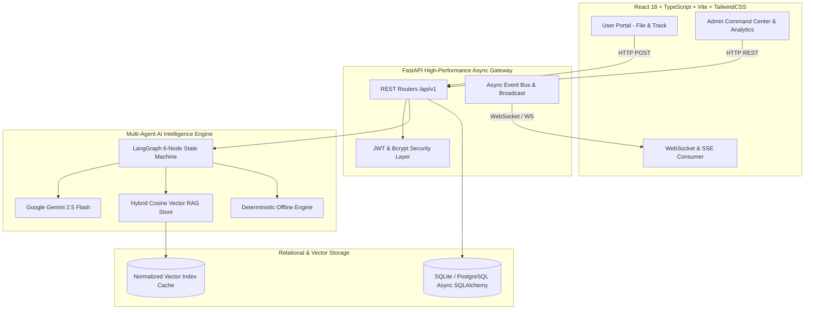
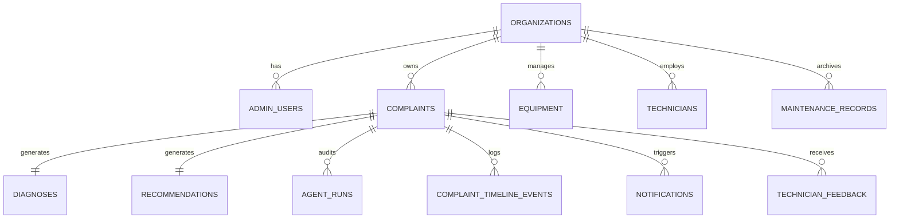

# 🏛️ FacilityMind AI — Autonomous Multi-Agent Facility & Infrastructure Decision Platform

[](https://fastapi.tiangolo.com)
[](https://react.dev)
[](https://www.typescriptlang.org)
[](https://www.python.org)
[](https://langchain-ai.github.io/langgraph/)
[](https://ai.google.dev/)
[](https://sqlite.org)
[](https://tailwindcss.com)
[](LICENSE)
[]()

> **From Ambiguous Facility Breakdown to Evidence-Backed Decision in Under 2 Seconds.**  
> *Autonomous 6-Agent LangGraph Pipeline · Real-Time Dual WebSocket / SSE Synchronization · Dynamic Organization Onboarding · Zero Preloaded Data on Fresh Clone · Multi-Portal Architecture (User, Admin, Backend) · Financial & Vendor Settlement in ₹ INR.*

---

## 📑 Table of Contents
1. [Overview](#1-overview)
2. [Problem Statement](#2-problem-statement)
3. [Problem Being Solved](#3-problem-being-solved)
4. [Solution](#4-solution)
5. [Who Can Use It](#5-who-can-use-it)
6. [How It Works](#6-how-it-works)
7. [System Architecture](#7-system-architecture)
8. [Three Portal Architecture](#8-three-portal-architecture)
9. [User / Student Portal](#9-user--student-portal)
10. [Admin / Operations Portal](#10-admin--operations-portal)
11. [Secure Backend & API Layer](#11-secure-backend--api-layer)
12. [Organization Setup & Dynamic Configuration](#12-organization-setup--dynamic-configuration)
13. [Complaint Lifecycle](#13-complaint-lifecycle)
14. [Multi-Agent AI Intelligence Layer](#14-multi-agent-ai-intelligence-layer)
15. [RAG / Historical Case Retrieval](#15-rag--historical-case-retrieval)
16. [Admin & User AI Assistants](#16-admin--user-ai-assistants)
17. [Real-Time Complaint Updates](#17-real-time-complaint-updates)
18. [Database Architecture & Data Models](#18-database-architecture--data-models)
19. [Authentication & Access Control](#19-authentication--access-control)
20. [Security & Isolation](#20-security--isolation)
21. [Financial & Worker Management](#21-financial--worker-management)
22. [Analytics & Operations Intelligence](#22-analytics--operations-intelligence)
23. [Project Directory Structure](#23-project-directory-structure)
24. [Requirements & Prerequisites](#24-requirements--prerequisites)
25. [Installation & Setup](#25-installation--setup)
26. [First-Time Setup & Onboarding Wizard](#26-first-time-setup--onboarding-wizard)
27. [Environment Variables](#27-environment-variables)
28. [Gemini API Configuration](#28-gemini-api-configuration)
29. [Running Locally](#29-running-locally)
30. [START.bat (Windows One-Click Launcher)](#30-startbat-windows-one-click-launcher)
31. [User Workflow Walkthrough](#31-user-workflow-walkthrough)
32. [Admin Workflow Walkthrough](#32-admin-workflow-walkthrough)
33. [Example Complaint Walkthrough](#33-example-complaint-walkthrough)
34. [Testing & Quality Verification](#34-testing--quality-verification)
35. [Troubleshooting Guide](#35-troubleshooting-guide)
36. [Deployment & Containerization](#36-deployment--containerization)
37. [Limitations & Roadmap](#37-limitations--roadmap)
38. [Team & Credits](#38-team--credits)

---

## 1. Overview

**FacilityMind AI** is an enterprise-grade, autonomous facility and infrastructure decision intelligence platform. Designed to bridge the operational divide between non-technical building occupants and maintenance administration, FacilityMind AI replaces slow, fragmented ticket logging with real-time multi-agent diagnostics, precedent-grounded recommendations, and live lifecycle synchronization.

When a student or employee reports an issue (*e.g., "Air conditioner in Block B Lab 2 is rattling violently and leaking brown liquid"*), FacilityMind AI:
1. Normalizes the unstructured narrative into clinical physical symptoms.
2. Retrieves matching historical engineering precedents via hybrid semantic vector search in under 50ms.
3. Synthesizes root cause diagnoses and safety risk ratings using Google Gemini 2.5 Flash.
4. Prescribes step-by-step repair checklists, spare parts required, technician trade matching, and expected expenditure in **₹ INR**.
5. Dispatches updates instantly across separate User and Admin portals via WebSockets and Server-Sent Events.

---

## 2. Problem Statement

Modern university campuses, corporate business parks, and hospital complexes operate complex physical equipment including HVAC chillers, backup diesel generators, high-speed passenger elevators, and emergency power inverters. However, traditional facility operations suffer from critical vulnerabilities:
- **No Structured Diagnostic Triage**: Complaints are submitted via disparate channels (WhatsApp, phone calls, paper slips, or slow ticketing forms) with zero preliminary engineering analysis.
- **Lost Institutional Knowledge**: Experienced technicians retire or leave, taking decades of troubleshooting experience with them. Recurring faults are treated as novel issues, leading to repeated trial-and-error repairs.
- **Budgetary Leakage & Cost Blindness**: Organizations lack transparency into whether repair quotes from external contractors reflect actual historical market rates or inflated vendor billing.

---

## 3. Problem Being Solved

| Traditional Maintenance Ticketing | FacilityMind AI Decision Platform |
| :--- | :--- |
| **Vague, Unstructured Tickets**: Non-technical users write *"AC broken"*, giving technicians zero advance context. | **Autonomous 6-Agent Triage**: Extracts equipment type, subcomponent, exact location, symptoms, and severity within 1.5s. |
| **Trial-and-Error Troubleshooting**: Technicians arrive on-site with wrong tools and incorrect spare parts. | **Evidence-Backed Precedents**: Matches symptoms against historical cases to prescribe required tools and replacement components beforehand. |
| **Opaque Status Black Hole**: Users never know if their complaint was seen, assigned, or ignored. | **Live Real-Time Lifecycle Sync**: Transparent 7-stage event timeline (`SUBMITTED` ➔ `AI_ANALYZED` ➔ `ASSIGNED` ➔ `IN_PROGRESS` ➔ `RESOLVED` ➔ `CLOSED`). |
| **Uncontrolled Repair Expenses**: Invoices are approved without validation against historical benchmarks. | **₹ INR Budgetary Intelligence**: Calculates projected min/max repair bounds, tracks technician labor vs. parts, and aggregates lifetime expenditure. |

---

## 4. Solution

FacilityMind AI provides a unified three-portal architecture:
- **Zero Hardcoded Data**: Repository ships completely clean. On initial launch, an automated Setup Wizard configures the system for the specific institution.
- **Multi-Agent Deliberation**: Six specialized LangGraph agents deliberate over each issue with deterministic fallback engines guaranteeing 100% uptime even without external internet connectivity.
- **Strict Role Separation**: Public User Portal allows students to file and track tickets with tracking codes (e.g., `FM-0001`), while the secure Admin Command Center provides full triage, analytics, technician assignment, and password control.

---

## 5. Who Can Use It

The platform dynamically reconfigures its categories, terminology, and workflows based on the selected organization archetype during first-time setup:

1. **Universities & Colleges**: Academic wings, lecture halls, computer laboratories, dormitories, mess halls, air conditioners, water coolers, generators, elevators, projectors.
2. **Hospitals & Healthcare Facilities**: Intensive Care Units, operating theaters, diagnostic radiology, medical gas pipelines, central sterilization, patient wards.
3. **Corporate Tech Parks & Commercial Offices**: Server rooms, cafeteria air handling units, access control turnstiles, boardrooms, fire suppression.
4. **Shopping Malls & Retail Hubs**: Escalators, central chiller plants, emergency lighting, waste compactors, parking elevators.
5. **Residential Societies & Gated Communities**: Clubhouse facilities, swimming pool filtration pumps, rainwater harvesting systems, overhead water tanks.

---

## 6. How It Works

```
┌─────────────────────────────────────────────────────────────────────────────────────────────┐
│                                 FACILITYMIND AI WORKFLOW                                    │
└─────────────────────────────────────────────────────────────────────────────────────────────┘
          User / Student Portal                           Admin Operations Portal
                   │                                                 │
  1. File Complaint (Raw Text/Voice)                                  │
                   │                                                 │
                   ▼                                                 │
     [FastAPI Ingestion Endpoint]                                    │
                   │                                                 │
                   ▼                                                 │
     [LangGraph 6-Agent Pipeline]                                    │
     • Entity Extraction & Triage                                    │
     • Sub-50ms Vector RAG Retrieval                                 │
     • Gemini 2.5 Flash Root-Cause Diagnosis                         │
     • Step-by-Step Repair Prescription                              │
     • ₹ INR Labor & Parts Estimation                                │
                   │                                                 │
                   ├─────────────────────────────────────────────────► 2. Live Notification
                   │                                                    (Incoming Triage)
                   │                                                 │
                   ▼                                                 ▼
  3. Live Ticket Tracking (FM-XXXX) ◄── [WebSocket Broadcast] ─────── 4. Admin Work Order
     • Timeline Events                     (State Sync)                 • Assign Technician
     • Public Resolution Notes                                          • Settle Labor/Parts
     • Reopen Capability                                                • Close Complaint
```

---

## 7. System Architecture



---

## 8. Three Portal Architecture

FacilityMind AI enforces complete architectural isolation between three operational domains:

```
┌─────────────────────────┐   ┌─────────────────────────┐   ┌─────────────────────────┐
│        PORTAL 1         │   │        PORTAL 2         │   │        PORTAL 3         │
│   User / Student Hub    │   │  Admin Operations Hub   │   │  Secure Backend & API   │
├─────────────────────────┤   ├─────────────────────────┤   ├─────────────────────────┤
│ • Public Complaint Form │   │ • Protected by JWT Auth │   │ • FastAPI Async Core    │
│ • Live FM-XXXX Tracking │   │ • Triage Command Center │   │ • Gemini AI Multi-Agent │
│ • User Phone History    │   │ • Worker & Payout Mgmt  │   │ • WebSocket Event Bus   │
│ • Real-Time Timeline    │   │ • Cost Analytics (₹)    │   │ • Database Migrations   │
│ • Student AI Assistant  │   │ • Knowledge Base Editor │   │ • Swagger Docs (/docs)  │
└─────────────────────────┘   └─────────────────────────┘   └─────────────────────────┘
```

---

## 9. User / Student Portal

Designed with a clean, responsive layout accessible without authentication:
- **Intelligent Complaint Filing**: Users submit issues in natural language. Form supports auto-fill for building, floor, room, and equipment type based on the active organization profile.
- **Public Ticket Tracking**: Anyone with a tracking code (`FM-0001`) can view real-time progression, assigned technician details, and public resolution notes.
- **My Complaints Tab**: Remembers the reporter's phone number locally, automatically aggregating all tickets filed by that user.
- **Reopen Mechanism**: If a repair was ineffective, complainants can reopen the ticket with mandatory feedback, instantly notifying administrators.
- **User AI Assistant**: Context-aware chatbot assisting users in drafting detailed complaints or checking status.

---

## 10. Admin / Operations Portal

Protected by bcrypt-hashed credentials and JWT tokens:
- **Triage Command Center**: Real-time incoming queue of complaints with urgency badges (`Critical`, `High`, `Medium`, `Low`).
- **One-Click Work Order Dispatch**: Assign technicians from the verified staff roster, transitioning work orders to `Technician Assigned`.
- **Financial Settlement**: Record actual labor charges, parts costs, and internal administrative notes upon resolving complaints.
- **Profile & Credential Management**: Administrators can update their username, display name, and password directly from the navigation bar.
- **Knowledge Base & RAG Management**: View all historical precedents and inject new maintenance records into the vector search space with zero server downtime.

---

## 11. Secure Backend & API Layer

Powered by **FastAPI 0.115** and **Async SQLAlchemy**:
- **Fully Asynchronous Execution**: Non-blocking I/O across database operations and multi-agent AI execution.
- **Dual WebSocket & SSE Support**: `/api/v1/ws` provides low-latency bi-directional streaming; fallback HTTP polling ensures resilient communication across restricted enterprise proxies.
- **Interactive Documentation**: Self-documenting OpenAPI schemas available at `http://localhost:8000/docs` and `http://localhost:8000/redoc`.

---

## 12. Organization Setup & Dynamic Configuration

When FacilityMind AI is cloned and launched for the first time, it operates in **Fresh Install Mode**:
- `GET /api/v1/organization/status` returns `setup_completed: false`.
- The frontend automatically launches the **Organization Onboarding Wizard**.
- The setup administrator specifies:
  - Organization Name (e.g., *Apex Institute of Technology*, *City Care Multi-Specialty Hospital*)
  - Organization Archetype (*College*, *Hospital*, *Corporate*, *Mall*, *Residential*)
  - Primary Location, City, State, and Campus Blocks
  - Custom Equipment Categories
  - Administrator Name, Username, and Password
  - Optional: Load curated demonstration dataset (265 domain records) or start with a 100% blank database.
- Once configured, all dropdowns, headers, and AI prompts dynamically adapt to the organization's identity.

---

## 13. Complaint Lifecycle

Each complaint transitions through a strict, auditable lifecycle:

```
[1. SUBMITTED] ──► [2. AI_ANALYZED] ──► [3. UNDER_REVIEW] ──► [4. ASSIGNED]
     │                    │                     │                   │
  User logs           6 Agents run         Triage team         Technician
  complaint          root-cause & cost     inspects report     dispatched
                                                                    │
[7. REOPENED]  ◄── [6. CLOSED]      ◄── [5. RESOLVED]    ◄─────────┘
     ▲                    │                     │
     │             Audit verified         Labor & parts
  User flags                              cost settled
  unresolved
```

Every stage automatically writes an immutable record to the `complaint_timeline_events` table with actor role and timestamp.

---

## 14. Multi-Agent AI Intelligence Layer

The decision engine utilizes a 6-node LangGraph state machine:

1. **Analyzer Agent (`analyzer_agent.py`)**: Normalizes raw user narratives into standardized equipment types, physical symptom keywords, and baseline urgency ratings.
2. **Retrieval Agent (`retrieval_agent.py`)**: Executes sub-50ms hybrid vector search across the historical case knowledge base to find top matching precedents.
3. **Diagnosis Agent (`diagnosis_agent.py`)**: Synthesizes current symptoms with historical evidence via Google Gemini 2.5 Flash to identify root failure modes with probabilistic confidence scores.
4. **Recommendation Agent (`recommendation_agent.py`)**: Formulates numbered repair steps, required diagnostic tools, replacement spare parts, technician trade matching, and expected expenditure in ₹ INR.
5. **Explanation Agent (`explanation_agent.py`)**: Translates technical diagnoses into transparent, human-readable rationales accessible to facility directors.
6. **Supervisor / Validation Agent (`supervisor_agent.py`)**: Enforces safety guardrails, validates numerical cost ranges, and falls back to deterministic rule trees if external LLM APIs are unreachable.

---

## 15. RAG / Historical Case Retrieval

- **Vector Engine**: Cosine similarity retrieval over high-dimensional vector embeddings with pre-normalized vectors for sub-50ms execution.
- **Hybrid Scoring**: Combines dense semantic similarity with exact keyword matching on equipment model numbers, error codes, and building zones.
- **Dynamic Learning**: When an administrator marks a complaint resolved with verified technician feedback, the system generates new embeddings and updates the live vector index immediately.

---

## 16. Admin & User AI Assistants

- **Admin AI Assistant**: Trained on facility operations, budget management, and preventive maintenance. Can answer questions like *"What was our total expenditure on HVAC in Block B this quarter?"* or *"Which elevator exhibits the highest frequency of door-sensor faults?"*.
- **User AI Assistant**: Designed for students and staff. Helps draft clear symptom descriptions, answers facility queries (*"Where is the lost and found?"*), and tracks ticket statuses via phone number or tracking ID.

---

## 17. Real-Time Complaint Updates

- **WebSocket Broadcast Engine**: Broadcasts `complaint.created`, `complaint.status_changed`, `complaint.assigned`, and `complaint.resolved` events.
- **Zero-Refresh UI**: The Admin Command Center and User Tracking views update instantaneously without requiring manual page reloads.
- **Heartbeat & Auto-Reconnect**: Frontend WebSocket client automatically reconnects within 4 seconds upon temporary network interruption.

---

## 18. Database Architecture & Data Models

FacilityMind AI uses Async SQLAlchemy with SQLite (default) or PostgreSQL. Key tables include:



- `organizations`: Multi-tenant configuration, branding, locations, and settings.
- `admin_users`: Bcrypt password hashes, admin roles, email, and phone credentials.
- `complaints`: Core ticket lifecycle, symptoms, severity, assigned technician, and ₹ actual costs.
- `complaint_timeline_events`: Chronological audit trail of all lifecycle state transitions.
- `maintenance_records`: Historical precedent knowledge base used by the RAG vector index.
- `technicians`: Active facility staff roster, trade specialty, total jobs completed, and earnings.

---

## 19. Authentication & Access Control

- **Password Security**: Passwords are encrypted using `bcrypt` via `passlib.context.CryptContext`.
- **JWT Tokens**: HS256 signed JSON Web Tokens with configurable expiration (`JWT_EXPIRATION_MINUTES=1440`).
- **Password Modification**: Administrators can change their username and password via `POST /api/v1/organization/change-password`, requiring validation of their existing password.

---

## 20. Security & Isolation

- **API Key Masking**: Gemini API keys are never returned in public API payloads; responses display masked tokens (`AIzaSy...****`).
- **CORS Protection**: Restricted to authorized origins (`localhost:5173`, `localhost:3000`).
- **Clean Database Delivery**: Repository contains zero production data, personal identifiers, or pre-seeded credentials.

---

## 21. Financial & Worker Management

- **₹ INR Currency Standardization**: All costs throughout the UI and backend are formatted in Indian Rupees (`₹`).
- **Cost Variance Analysis**: Directly compares projected AI cost ranges against actual technician invoices.
- **Technician Tracking**: Automatically increments job counts and accumulates earnings upon complaint resolution.

---

## 22. Analytics & Operations Intelligence

- **Mean Time to Repair (MTTR)**: Real-time calculation of average resolution duration in hours.
- **Category & Location Breakdown**: Identifies high-wear equipment and chronic breakdown zones across campus.
- **Monthly Outlay Trends**: Tracks historical maintenance expenditure over time.

---

## 23. Project Directory Structure

```
FacilityMind-ai/
├── .env.example                 # Safe environment configuration template
├── .gitignore                   # Comprehensive ignores for .env, *.db, cache, logs
├── README.md                    # System documentation
├── START.bat                    # Windows one-click dual launcher
├── run.py                       # Python cross-platform runner with auto-browser launch
├── data/
│   ├── synthetic_complaints_dataset.csv  # 265 curated domain precedents (optional load)
│   └── vector_index.json                 # Auto-generated vector index cache
├── backend/
│   ├── app/
│   │   ├── main.py              # FastAPI application factory & lifespan handler
│   │   ├── agents/              # LangGraph 6-node multi-agent implementation
│   │   ├── api/v1/              # REST routers (complaints, org, auth, analytics)
│   │   ├── core/                # Config, security, events, vector store, logging
│   │   ├── database/            # SQLAlchemy async session & table models
│   │   ├── schemas/             # Pydantic validation schemas
│   │   └── services/            # Gemini AI service, analytics, seed loader
│   └── tests/                   # 19 comprehensive pytest integration tests
├── frontend/
│   ├── src/
│   │   ├── App.tsx              # Root React component & portal router
│   │   ├── components/          # Navbar, Modals (Login, Onboarding, Password)
│   │   ├── pages/               # UserPortalView, DashboardView, DecisionReportView
│   │   ├── services/            # Axios API layer & WebSocket client
│   │   └── types/               # TypeScript interfaces
│   └── tests/                   # Vitest UI component integration tests
└── scripts/
    ├── clean_reset.py           # Hard reset utility (resets DB to 0 rows for clean install)
    ├── test_lifecycle.py        # 7-stage end-to-end complaint lifecycle test
    └── verify.py                # Comprehensive quality gate verification runner
```

---

## 24. Requirements & Prerequisites

- **Python**: Version `3.10` or higher (`3.11` recommended)
- **Node.js**: Version `18.0.0` or higher (`npm` package manager)
- **Operating System**: Windows 10/11, macOS, or Linux (Ubuntu 22.04+)
- **Memory**: Minimum 4 GB RAM (8 GB recommended)

---

## 25. Installation & Setup

### Step 1: Clone Repository
```bash
git clone https://github.com/ayaanamp/FacilityMind-ai.git
cd FacilityMind-ai
```

### Step 2: Backend Setup
```bash
cd backend
python -m venv .venv

# On Windows:
.venv\Scripts\activate
# On macOS/Linux:
source .venv/bin/activate

pip install -r requirements.txt
cd ..
```

### Step 3: Frontend Setup
```bash
cd frontend
npm install
cd ..
```

---

## 26. First-Time Setup & Onboarding Wizard

1. Copy `.env.example` to `.env` (optional; default SQLite database requires zero configuration):
   ```bash
   cp .env.example .env
   ```
2. Launch the application (see [Running Locally](#29-running-locally)).
3. Open `http://localhost:5173` in your browser.
4. Because the database is 100% fresh, the **Organization Setup Wizard** will automatically appear.
5. Enter your institution details, choose your equipment types, create your administrator password, and click **Initialize Organization**.

---

## 27. Environment Variables

All variables have safe fallbacks. Configured via `.env` in the root directory:

| Variable | Default | Description |
| :--- | :--- | :--- |
| `GEMINI_API_KEY` | *(empty string)* | Google Gemini API key. If unset, deterministic fallback engine activates. |
| `DATABASE_URL` | `sqlite+aiosqlite:///./data/facilitymind.db` | Async database connection string. |
| `SECRET_KEY` | `dev-secret-key-replace-in-production` | Secret key for signing JWT tokens. |
| `JWT_EXPIRATION_MINUTES` | `1440` | JWT token validity period (24 hours). |
| `ENVIRONMENT` | `development` | Deployment environment (`development` / `production`). |

---

## 28. Gemini API Configuration

To enable live Google Gemini 2.5 Flash reasoning:
1. Obtain a free API key from [Google AI Studio](https://aistudio.google.com/).
2. Add your key to `.env`:
   ```env
   GEMINI_API_KEY=AIzaSyYourActualKeyHere
   ```
3. Alternatively, administrators can enter or update the key dynamically at runtime through the **Organization Settings** modal in the Admin Portal.

---

## 29. Running Locally

You can launch both frontend and backend concurrently with a single command:

```bash
python run.py
```

`run.py` validates dependencies, activates the virtual environment, spins up FastAPI on `http://localhost:8000`, starts Vite on `http://localhost:5173`, and automatically opens your default web browser.

---

## 30. START.bat (Windows One-Click Launcher)

On Windows systems, simply double-click **`START.bat`** in the root directory. It automatically:
- Checks Python and Node.js installations
- Verifies virtual environment existence
- Launches Backend (`localhost:8000`) and Frontend (`localhost:5173`) in independent terminal consoles
- Opens the application directly in your browser

---

## 31. User Workflow Walkthrough

1. Navigate to `http://localhost:5173`.
2. Click **Submit Complaint**.
3. Select your campus location (*e.g., Science Wing, Floor 2, Room 204*).
4. Enter the issue description: *"Water cooler is dispensing lukewarm water and making a humming sound"*.
5. Click **Submit Infrastructure Complaint**.
6. Receive an instant tracking code (e.g., `FM-0001`) with multi-agent diagnosis and estimated repair duration.
7. Switch to the **Live Ticket Tracking** tab anytime to check repair status.

---

## 32. Admin Workflow Walkthrough

1. On `http://localhost:5173`, click **Admin Sign In** in the top right.
2. Enter your administrator username and password created during onboarding.
3. In the **Command Center**, view newly triaged complaints in real time.
4. Click **Assign Technician** and select a qualified specialist from the roster.
5. When on-site repairs are completed, click **Resolve Complaint**, record labor and parts costs, enter verified technician notes, and submit.
6. The user's tracking view updates to `RESOLVED` instantly.

---

## 33. Example Complaint Walkthrough

### Central AC Breakdown Scenario
- **Input**: *"Central AC in Computer Lab 3 is blowing warm air, producing an electrical burning smell, and tripping circuit breakers."*
- **Triage Result**:
  - Equipment: `Air Conditioner / HVAC`
  - Severity: `Critical`
  - Urgency: Immediate action required (electrical hazard)
- **Precedent Retrieved**: Case `#MC-0412` (*Blower motor capacitor short circuit and contactor arc damage* - 94.2% semantic similarity).
- **Diagnosis**: *Compressor capacitor breakdown causing severe locked rotor amp draw and thermal safety disconnect.*
- **Prescribed Checklist**:
  1. Lockout/tagout primary 415V three-phase breaker.
  2. Discharge and test dual run capacitor with digital capacitance meter.
  3. Inspect compressor contactor points for severe carbon pitting.
  4. Replace 45/5 uF capacitor and 30A contactor.
  5. Measure running current draw against rated full-load amperage.
- **Financial Estimate**: ₹2,800 - ₹4,200 (Labor: ₹750, Parts: ₹2,400).

---

## 34. Testing & Quality Verification

Run the full automated verification gate:

```bash
# Run the complete test suite (Backend Lint + Pytest + Vite Build + Vitest)
python scripts/verify.py

# Run the 7-stage end-to-end complaint lifecycle test
python scripts/test_lifecycle.py
```

### Verification Gate Output
```
============================================================
FACILITYMIND AI PLATFORM VERIFICATION GATE
============================================================
 - Backend Lint (Ruff)                     : PASSED
 - Backend Tests (Pytest - 19 tests)       : PASSED
 - Backend App Import Check                : PASSED
 - Frontend Build (TypeScript & Vite)      : PASSED
 - Frontend Tests (Vitest - 3 tests)       : PASSED
============================================================
ALL QUALITY GATES PASSED [100% SUCCESS]
```

---

## 35. Troubleshooting Guide

- **Port 8000 or 5173 Already in Use**:
  ```bash
  # Windows
  netstat -ano | findstr :8000
  taskkill /PID <PID> /F
  ```
- **Virtual Environment Not Found**:
  ```bash
  cd backend && python -m venv .venv && .venv\Scripts\activate && pip install -r requirements.txt
  ```
- **Reset Database to Completely Blank**:
  ```bash
  python scripts/clean_reset.py
  ```

---

## 36. Deployment & Containerization

FacilityMind AI is production-ready for Docker and containerized orchestration:

```dockerfile
# Multi-stage Dockerfile
FROM node:18-alpine AS frontend-builder
WORKDIR /app/frontend
COPY frontend/package*.json ./
RUN npm install
COPY frontend/ ./
RUN npm run build

FROM python:3.11-slim
WORKDIR /app
COPY backend/requirements.txt ./
RUN pip install --no-cache-dir -r requirements.txt
COPY backend/ ./backend
COPY data/ ./data
COPY --from=frontend-builder /app/frontend/dist ./frontend/dist

EXPOSE 8000
CMD ["python", "-m", "uvicorn", "backend.app.main:app", "--host", "0.0.0.0", "--port", "8000"]
```

---

## 37. Limitations & Roadmap

- **Current Limitations**:
  - IoT telemetry currently ingested via natural language description rather than direct MQTT sensor hardware streams.
  - SMS notifications require external Twilio/Gupshup API credentials.
- **Future Improvements**:
  - Direct Modbus / BACnet chiller telemetry ingestion.
  - Native Mobile Progressive Web App with camera barcode scanning.
  - Multilingual voice complaint filing in regional Indian languages via Gemini Audio.

---

## 38. Team & Credits

| Team Member | Engineering Role | Core Responsibilities |
| :--- | :--- | :--- |
| **Ayaan** | **Team Leader / Lead Developer** | System Architecture, LangGraph Multi-Agent Pipeline, End-to-End Platform Integration, Security & Release Readiness |
| **Rajashaker** | **Backend / API Engineer** | FastAPI REST Endpoints, Pydantic Schema Validation, Async Route Architecture & WebSocket Event Bus |
| **Manoj** | **Database / RAG / Data Engineer** | SQLAlchemy Persistence, SQLite Migrations, Vector Precedent Curation & Cosine Similarity Search |
| **Yadhas** | **Frontend / UI / Testing Engineer** | React 18 Obsidian Interface, TailwindCSS Design System, Vitest Component Tests & Quality Verification |

---

*FacilityMind AI — Autonomous Campus & Facility Decision Intelligence.*
